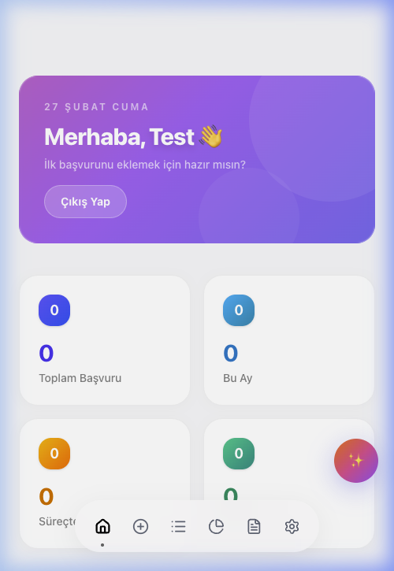
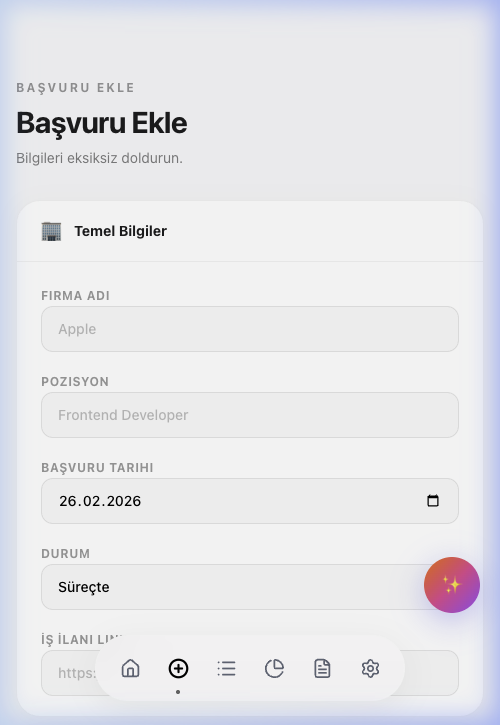
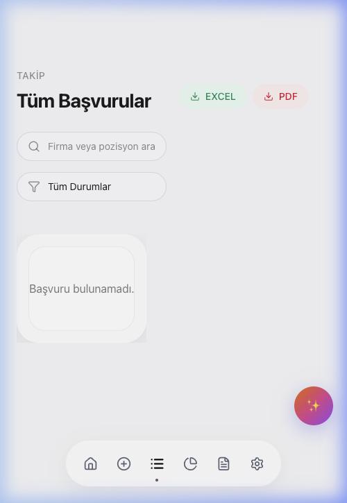
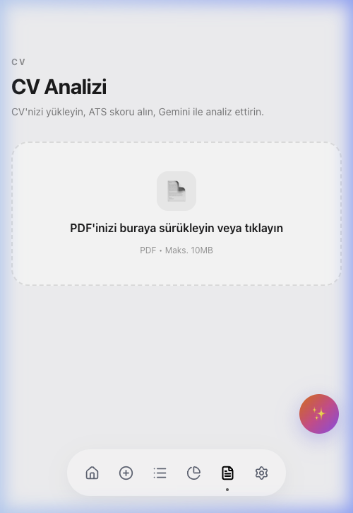
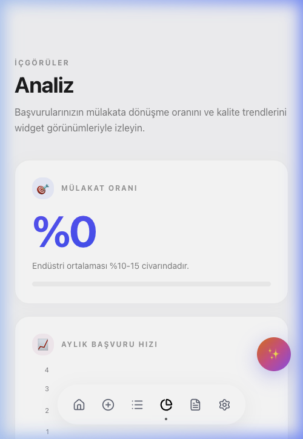

<h1 align="center">
  <br />
  NextStep — Akıllı İş Başvurusu Takip Sistemi
</h1>

<p align="center">
  <em>Tüm başvurularını tek ekranda yönet. CV'ni analiz et. Kariyerini verilerle geliştir.</em>
</p>

<p align="center">
  
  
  
  
  
  
</p>

<hr />

## 💡 Neden Yaptım?

İş başvurusu süreci düşündüğümden çok daha kaotik çıktı.

LinkedIn'den başvurduğum şirket hangisiydi? Cover letter'ı mı gönderdim? IK geri döndü mü? Bu soruların hepsine cevap vermek için önce Excel tablosu açtım. Sonra farklı sütunlar, farklı sayfalar, kayıp tarihler... Excel her işe yarar ama iş takibi için tasarlanmamış.

Bunun yerine, **tam olarak ihtiyacım olan şeyi sıfırdan yaptım:**

- Her başvuruyu ilgili tüm detaylarıyla (platform, motivasyon mektubu, IK görüşmesi notu, test linki...) kaydedebiliyorum
- Dashboard'dan anlık durumu görebiliyorum
- Hangi CV versiyonumun daha çok dönüş aldığını analiz edebiliyorum
- Gemini AI ile CV'mi ATS kriterlerine göre değerlendirebiliyorum
- Tamamen güvenli: her kullanıcı sadece kendi verilerini görebiliyor

Bu proje hem pratik bir ihtiyaca yanıt, hem de React / TypeScript / Firebase stack'iyle derinlemesine çalışma fırsatı oldu.

---

## 🌐 Canlı Demo

> *(Yakında yayınlanacak — Vercel / Firebase Hosting)*

---

## 📋 İçindekiler

1. [Özellikler](#-özellikler)
2. [Ekran Görüntüleri](#-ekran-görüntüleri)
3. [Kullanılan Teknolojiler](#️-kullanılan-teknolojiler)
4. [Proje Yapısı](#️-proje-yapısı)
5. [Kurulum & Çalıştırma](#-kurulum--çalıştırma)
6. [Ortam Değişkenleri](#-ortam-değişkenleri)
7. [Geliştirici](#-geliştirici)

---

## ✨ Özellikler

### 🔐 Kimlik Doğrulama
- Firebase Authentication ile e-posta / şifre girişi ve kayıt
- Şifre sıfırlama (e-posta ile)
- Kullanıcı bazlı veri izolasyonu (Firestore güvenlik kuralları)

### 📊 Dashboard (Anasayfa)
- Toplam, bu ay, süreçte ve olumlu sonuçlanan başvuru sayısı
- Son hareketler tablosu (şirket, durum, tarih, platform, CV versiyonu)
- Tarihle kişiselleştirilmiş karşılama ekranı

### ➕ Başvuru Ekle
Tek form ile kapsamlı başvuru kaydı:
- Firma adı, pozisyon, başvuru tarihi, durum
- Şehir, ülke, çalışma biçimi, sözleşme türü
- Platform (LinkedIn, Kariyer.net, Indeed, Doğrudan...)
- CV versiyonu, test linki, iş ilanı linki
- Motivasyon / cover letter metni
- IK görüşmesi ve notlar
- Diğer mülakat süreçleri ve geri bildirimler

### 📋 Başvurular
- Tüm başvuruların listelendiği tablo
- Şirket adı ve pozisyona göre arama
- Duruma göre filtre (Süreçte, Görüşme, Teklif, Red...)
- Excel ve PDF olarak dışa aktarma
- İlan linkine tek tıkla erişim
- Detay sayfası (satıra tıklayarak)

### 📈 Analiz
- Mülakat dönüş oranı
- Aylık başvuru hızı grafiği
- Durum dağılımı (donut chart)
- CV versiyonu performans karşılaştırması
- Motivasyon mektubu etkisi analizi
- Başvuru trendi (çizgi grafik)

### 📄 CV Analizi
- PDF yükleme
- ATS (Applicant Tracking System) skoru (0–100)
- Bölüm bazlı puanlama (anahtar kelimeler, iletişim, içerik uzunluğu...)
- İyileştirme önerileri
- **Gemini AI ile serbest soru sorma**: "Hangi bölümler eksik?", "Bu CV yazılım mühendisi ilanına uygun mu?"

### 🌐 Çoklu Dil
- Türkçe / İngilizce desteği
- Landing sayfasından dil geçişi

### 📱 Mobile-First Tasarım
- Responsive layout: mobil, tablet ve masaüstü
- Alt navigasyon çubuğu (Bottom Navigation)
- Touch-friendly arayüz

---

## 📸 Ekran Görüntüleri

### 🏠 Dashboard



---

### ➕ Başvuru Ekle



---

### 📋 Tüm Başvurular



---

### 📄 CV Analizi



---

### 📈 Analiz



---

## 🛠️ Kullanılan Teknolojiler

| Katman | Teknoloji |
|--------|-----------|
| **Frontend** | React 18, TypeScript, Vite |
| **Stil** | Tailwind CSS, Framer Motion |
| **State Yönetimi** | Zustand |
| **Routing** | React Router DOM v6 |
| **Backend / Auth** | Firebase Authentication |
| **Veritabanı** | Firebase Firestore |
| **AI** | Google Gemini 1.5 Flash API |
| **CV İşleme** | pdf.js |
| **Dışa Aktarma** | xlsx, jsPDF, jsPDF-AutoTable |
| **Grafik** | Recharts |
| **E-posta** | EmailJS |
| **İkonlar** | Lucide React |

---

## 🏗️ Proje Yapısı

```
src/
├── components/
│   ├── analytics/        # Grafik ve analiz bileşenleri
│   ├── applications/     # Başvuru tablosu
│   ├── Icons/            # SVG ikonlar ve logo
│   └── layout/           # Navbar, BottomNav
├── hooks/                # useAuth, useFirestore, vb.
├── pages/
│   ├── auth/             # Login, Register, ForgotPassword
│   ├── AddApplication.tsx
│   ├── Analytics.tsx
│   ├── Applications.tsx
│   ├── CV.tsx
│   ├── Dashboard.tsx
│   └── LandingPage.tsx
├── services/             # Firebase, Gemini API bağlantıları
├── store/                # Zustand store (useAppStore)
├── types/                # TypeScript tip tanımları
└── main.tsx
```

---

## 🚀 Kurulum & Çalıştırma

### Gereksinimler
- Node.js ≥ 18
- npm veya yarn
- Firebase projesi (Auth + Firestore)
- Google Gemini API anahtarı

### Adımlar

```bash
# Repoyu klonla
git clone https://github.com/kutluhangil/Job-Tracking-Web-Form.git
cd Job-Tracking-Web-Form

# Bağımlılıkları yükle
npm install

# Ortam değişkenlerini ayarla (aşağıya bak)
cp .env.example .env.local

# Geliştirme sunucusunu başlat
npm run dev
```

---

## 🔑 Ortam Değişkenleri

`.env.local` dosyası oluştur ve aşağıdaki değişkenleri doldur:

```env
# Firebase
VITE_FIREBASE_API_KEY=...
VITE_FIREBASE_AUTH_DOMAIN=...
VITE_FIREBASE_PROJECT_ID=...
VITE_FIREBASE_STORAGE_BUCKET=...
VITE_FIREBASE_MESSAGING_SENDER_ID=...
VITE_FIREBASE_APP_ID=...

# Google Gemini
VITE_GEMINI_API_KEY=...

# EmailJS (opsiyonel)
VITE_EMAILJS_SERVICE_ID=...
VITE_EMAILJS_TEMPLATE_ID=...
VITE_EMAILJS_PUBLIC_KEY=...
```

---

## 👤 Geliştirici

<table>
  <tr>
    <td align="center">
      <strong>Kutluhan Gül</strong><br />
      <em>Full Stack Developer</em><br /><br />
      <a href="https://github.com/kutluhangil">
        
      </a>
      <br />
      <a href="https://www.linkedin.com/in/kutluhangil/">
        
      </a>
    </td>
  </tr>
</table>

> Bu proje tamamen bireysel olarak, kişisel ihtiyaçtan doğarak geliştirilmiştir.
> İş arama sürecini daha sistematik ve veri odaklı hale getirmek için tasarlanmıştır.

---

## 📜 Lisans

Bu proje kişisel kullanım ve portföy amacıyla geliştirilmiştir.  
© 2026 NextStep — Kutluhan Gül. Tüm hakları saklıdır.
